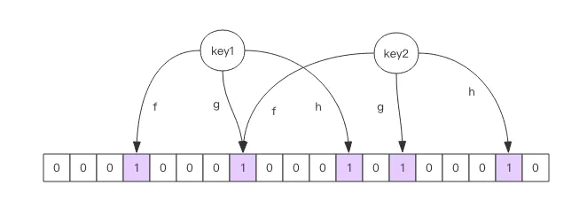

# 布隆过滤器原理

问：如何处理10G的黑名单，黑名单中是UserId，在黑名单中的用户不可访问首页

* 使用bitmap进行匹配

追问：100G的该怎么处理

* 使用布隆过滤器

问：布隆过滤器的原理说一下

每个布隆过滤器对应到 Redis 的数据结构里面就是一个大型的位数组和几个不一样的无偏 hash 函数。所谓无偏就是能够把元素的 hash 值算得比较均匀。

向布隆过滤器中添加 key 时，会使用多个 hash 函数对 key 进行 hash 算得一个整数索引值然后对位数组长度进行取模运算得到一个位置，每个 hash 函数都会算得一个不同的位置。再把位数组的这几个位置都置为 1 就完成了 add 操作。

向布隆过滤器询问 key 是否存在时，跟 add 一样，也会把 hash 的几个位置都算出来，看看位数组中这几个位置是否都为 1，只要有一个位为 0，那么说明布隆过滤器中这个 key 不存在。如果都是 1，这并不能说明这个 key 就一定存在，只是极有可能存在，因为这些位被置为 1 可能是因为其它的 key 存在所致。如果这个位数组比较稀疏，判断正确的概率就会很大，如果这个位数组比较拥挤，判断正确的概率就会降低。

使用时不要让实际元素远大于初始化大小，当实际元素开始超出初始化大小时，应该对布隆过滤器进行重建，重新分配一个 size 更大的过滤器，再将所有的历史元素批量 add 进去 